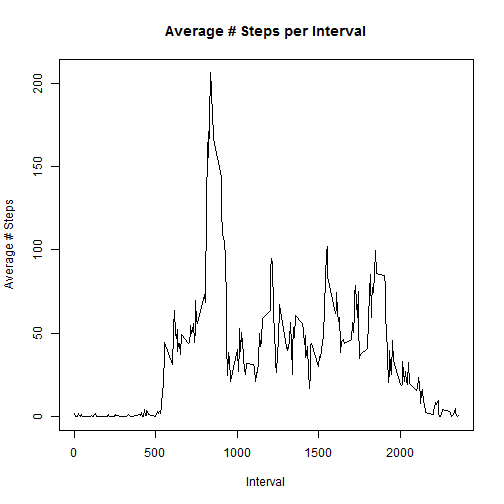
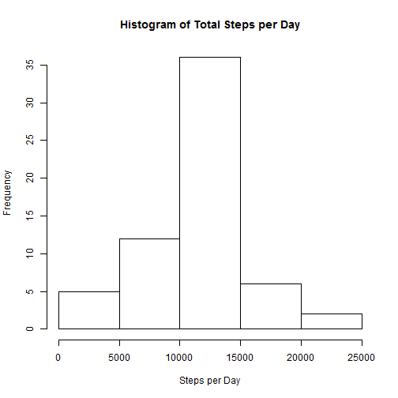
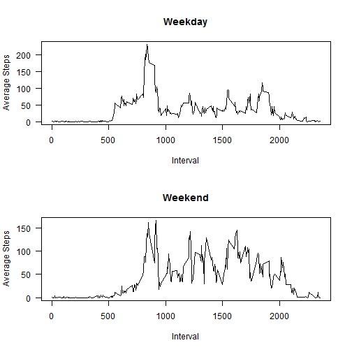

# Reproducible Research: Peer Assessment 1
Last modified on 2014-06-15

Report generated on Sun Jun 15 19:23:13 2014
 
-------------------------
## Loading and preprocessing the data

```r
setwd("~/GitHub/RepData_PeerAssessment1")
activity <- read.csv("~/GitHub/RepData_PeerAssessment1/activity.csv")
activity$date <- as.Date(activity$date)  #set date format correctly
```


----------------------------
## What is mean total number of steps taken per day?

```r
steps_by_day <- tapply(activity$steps, activity$date, sum)
hist(steps_by_day, main = "Histogram of Total Steps per Day", xlab = "Steps per Day")
```

 

**The mean number of steps per day (excluding the missing data) was 10766.19, and the median number of steps per day was 10765.**

------------------------------
## What is the average daily activity pattern?

```r
steps_by_interval <- tapply(activity$steps, activity$interval, mean, na.rm = T)
plot(x = names(steps_by_interval), y = steps_by_interval, type = "l", main = "Average # Steps per Interval", 
    xlab = "Interval", ylab = "Average # Steps")
```

 

**The interval with the greatest number of steps (averaged across all days) is interval 835, with a mean of 206.1698 steps during that interval.**


------------------------------
## Imputing missing values
There are 2304 missing _steps_ values (as NA) in the _activity_ dataset. We will impute these missing values using the mean number of steps for the associated interval across the entire dataset.

```r
imp_activity <- activity
imp_activity$imp_steps <- NA  #preset the column to hold imputed values to NA

# Imputation loop below: substitutes interval mean steps where steps is
# missing
for (i in 1:nrow(imp_activity)) {
    if (is.na(imp_activity$steps[i])) {
        imp_activity$imp_steps[i] <- steps_by_interval[names(steps_by_interval) == 
            imp_activity$interval[i]]
    } else {
        imp_activity$imp_steps[i] <- imp_activity$steps[i]
    }
}

imp_steps_by_day <- tapply(imp_activity$imp_steps, imp_activity$date, sum)
hist(imp_steps_by_day, main = "Histogram of Total Steps per Day", xlab = "Steps per Day")
```

 


**The mean number of total steps per day (including the newly-imputed data) was 10766.19, and the median number of steps per day was 10766. Note that the mean total steps per day did not change under imputation, and the median increased by one step.**


------------------------------
## Are there differences in activity patterns between weekdays and weekends?

```r
# To create the weekday/weekend flag
imp_activity$day_of_week <- weekdays(imp_activity$date, abbreviate = T)
imp_activity$day_type <- ifelse(imp_activity$day_of_week %in% c("Sat", "Sun"), 
    "Weekend", "Weekday")

# Average steps per interval across weekday/weekend split
weekday_split <- split(imp_activity, imp_activity$day_type)

weekend_steps_by_interval <- data.frame(tapply(weekday_split$Weekend$imp_steps, 
    weekday_split$Weekend$interval, mean))
weekend_steps_by_interval$day_type <- "Weekend"
weekend_steps_by_interval$interval <- rownames(weekend_steps_by_interval)
colnames(weekend_steps_by_interval) <- c("steps", "day_type", "interval")

weekday_steps_by_interval <- data.frame(tapply(weekday_split$Weekday$imp_steps, 
    weekday_split$Weekday$interval, mean))
weekday_steps_by_interval$day_type <- "Weekday"
weekday_steps_by_interval$interval <- rownames(weekday_steps_by_interval)
colnames(weekday_steps_by_interval) <- c("steps", "day_type", "interval")

par(mfrow = c(2, 1))
plot(x = weekday_steps_by_interval$interval, y = weekday_steps_by_interval$steps, 
    type = "l", main = "Weekday", xlab = "Interval", ylab = "Average Steps", 
    las = 1)
plot(x = weekend_steps_by_interval$interval, y = weekend_steps_by_interval$steps, 
    type = "l", main = "Weekend", xlab = "Interval", ylab = "Average Steps", 
    las = 1)
```

 


=======================================
